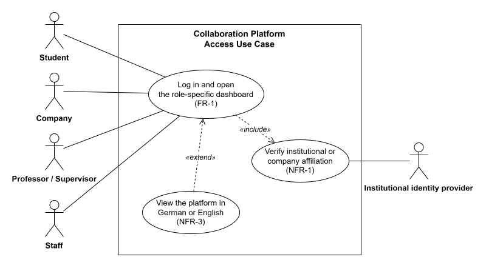
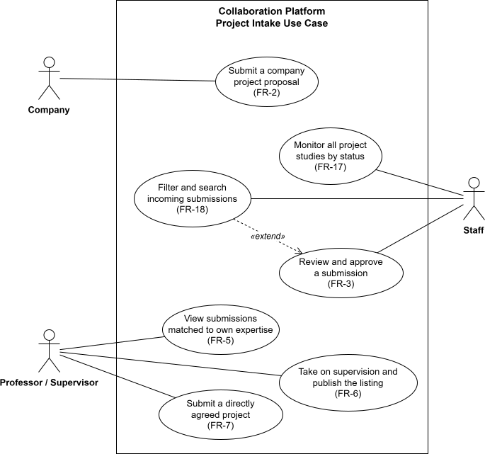
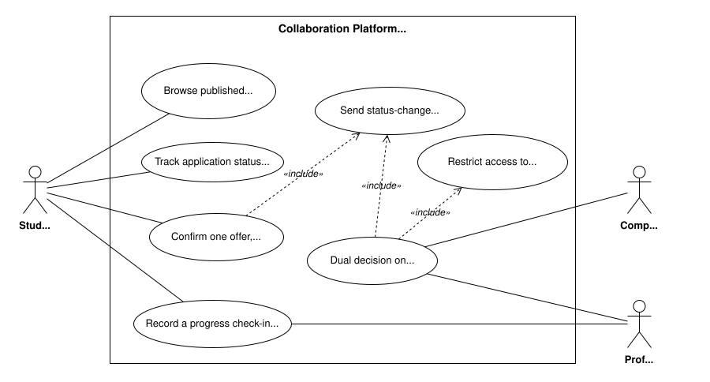
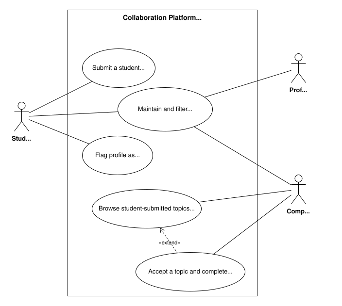

# Project Studies Platform (BirdVision × TUM Campus Heilbronn)

An SRS and interactive frontend prototype for the project-study process at TUM Campus Heilbronn, developed as a bachelor’s Project Study in collaboration with BirdVision. The platform brings the decentralized coordination between students, companies, supervising professorships, and administrative staff into one role-based workflow.

**Live interactive prototype:** https://nan1220.github.io/Collaboration_Platform/ <br>
**Full SRS:** [`Software Requirements Specification for Prototype - Nan Jiang, Jasmin Yalçın_submitted version.pdf`](<Software Requirements Specification for Prototype - Nan Jiang, Jasmin Yalçın_submitted version.pdf>) <br>
**Final-deliverable authors:** Nan Jiang and Jasmin Yalçın
## Demo video

<!-- TODO: replace with the actual video link (e.g. YouTube, or a committed file in demo/) -->
<!-- **[`Watch the demo`](<demo\demo role-based access and dual approval.mp4>)** — a quick walkthrough of the prototype, including: -->

https://github.com/user-attachments/assets/9137b877-a334-44d2-a657-0adf105fc62e

This short demo provides a sample walkthrough of the platform. Features shown include, but are not limited to: <br>
Role-Based Access, Dual Approval, Lightweight Progress Check-in, Student Browse Available Projects and Apply, Application Status Visibility, Status-Change Notifications.

<!-- ## What it does

Four roles, one shared project pipeline:

- **Companies** submit project topics, or browse and accept student-submitted topics.
- **Professors** take on supervision of a submitted project (setting deadlines and required documents) or submit a project themselves, then review student applications.
- **Students** browse open projects, apply with required documents, track application status, and optionally look for teammates.
- **Staff** review and approve incoming company submissions and get a master dashboard across every project's status (`Pending → Approved → Open → Ongoing → Complete`).

Requirements (FR-1 … FR-18, NFR-1 … NFR-3) were derived from 26 semi-structured interviews across all four stakeholder groups and are traced from pain point → requirement → prototype coverage in the SRS's traceability table (SRS: Appendix A.3: Full Requirements Traceability Matrix). -->

## Platform Workflow

The platform connects four roles in a shared project pipeline:

- **Companies** submit projects or browse student proposals.
- **Professors and supervisors** supervise projects and review applications.
- **Students** submit ideas, find teammates, browse projects, and apply.
- **Administrative staff** review submissions and monitor the `Pending → Approved → Open → Ongoing → Complete` workflow.


## Research Basis and Scope

The platform is scoped to the TUM Campus Heilbronn project-study process. Its SRS adapts ISO/IEC/IEEE 29148:2018 and draws on 26 interviews and written responses across four stakeholder groups. The data was consolidated into a response matrix and translated into evidence-based requirements, each traced from its source to its prototype coverage.

## Use Case Diagrams

We modeled the following use cases based on the requirements documented in the SRS.
|Platform Access|Project Intake|
|-|-|
|||

|Application and Selection|Profiles and Topics|
|-|-|
|||

## Implemented Requirements

The prototype covers the following requirements marked as **Built** in the SRS traceability table (Appendix A.3: Full Requirements Traceability Matrix).

#### Access

- **FR-1 — Role-Based Access:** Tailored access and dashboards for students, companies, professors/supervisors, and staff.
- **NFR-1 — Identity Verification:** Institutional authentication and company-domain verification.

#### Company Features

- **FR-2 — Company Project Submission Portal:** Structured project submission with mandatory project information.
- **FR-3 — Submission Review and Approval:** New submissions receive a pending status and undergo staff review.

#### Professor and Supervisor Features

- **FR-5 — Profiles and Expertise Matching:** Professor profiles and project recommendations based on expertise.
- **FR-6 — Supervision Take-on:** Professors can provide supervision details before making projects visible to students.
- **FR-7 — Direct Project Submission:** Professors can submit projects already agreed upon with companies.

#### Student Features

- **FR-8 — Student Project Submission Portal:** Students can submit project proposals using structured fields.
- **FR-9 — Student Profiles:** Profiles display students’ degree programs.
- **FR-10 — Student Team Matching:** Students can indicate that they are seeking teammates and provide contact details.
- **FR-11 — Project Browsing and Applications:** Students can browse available projects and apply.
- **FR-12 — Application Status Visibility:** Students can view whether applications have been accepted or rejected.

#### General Features

- **NFR-3 — Language Support:** The platform is available in English and German.
- **FR-13 — Status-Change Notifications:** Notifications are provided when application statuses change or listings close.
- **FR-14 — Lightweight Progress Check-in:** Students and supervisors can record simple project progress updates.
- **FR-15 — Dual Approval:** Student applications require approval from both the supervisor and company.
- **FR-16 — Manual Multi-Offer Decision:** Students can accept one offer and withdraw their other applications.

#### Staff Features

- **FR-17 — Staff Master Dashboard:** Staff can view project studies across all workflow statuses.
- **FR-18 — Submission Filtering:** Staff can search and filter incoming company submissions.


<!-- ## Repo layout

```
Platform_SRS_file/   SRS source (Typst) and rendered PDF
frontend/             Next.js prototype (App Router, TypeScript, Tailwind, shadcn/ui)
backend/              Django + DRF scaffold (models for the same domain; not wired to the prototype)
architecture.md        Early architecture/tech-stack sketch
requirements.md        Raw notes from the initial stakeholder conversation
``` -->

## Running the prototype

The frontend prototype is a **fully in-browser mock** — no backend or database required. All data lives in `frontend/src/lib/mock-store.ts` and resets on reload.

```bash
python start_frontend.py
# or, from frontend/:
npm install && npm run dev
```

Open http://localhost:3000.

The `backend/` Django project (`uv run manage.py runserver` from `backend/`) is a standalone schema sketch for a real deployment and isn't consumed by the frontend prototype — see the SRS's Scope Boundary section for why the prototype is frontend-only.

## Deployment

The frontend builds as a static export (`next build`, `output: "export"`) and is published to GitHub Pages at the base path `/Collaboration_Platform`.

<!-- ## Team & Contributions

**Team members:** Nan Jiang, Jasmin Yalçın, and Ahmet Akpunar  

**Authors and developers of the final deliverables:**
- Nan Jiang
- Jasmin Yalçın

The project produced three deliverables: an SRS, a prototype, and presentation slides.
- **Research approach:** Nan developed the literature and methodological basis for the requirements engineering process; Jasmin reviewed and refined the interview methodology.
- **Data collection:** All three team members contributed stakeholder data. Nan and Jasmin conducted and documented the main in-person interviews, while Ahmet provided additional written inputs collected by email.
- **Response matrix and analysis:** Nan designed the response matrix and its classification structure (SRS Section 3.1). Nan analyzed one-third of the data, while Jasmin analyzed the remaining two-thirds, including Ahmet's raw inputs.
- **Requirements analysis:** Jasmin led the synthesis of interview data into requirements; Nan reviewed and refined the results.
- **SRS:** Written exclusively by Nan and Jasmin.
- **Prototype:**  Designed and developed by Nan based on the SRS requirements, with feedback from Jasmin.
- **Presentation slides:** Prepared by Nan and Jasmin.

Ahmet was not directly involved in writing the SRS, preparing the presentation slides, or implementing the prototype. -->


<!-- ## Team & Contributions

- **Team members:** Nan Jiang, Jasmin Yalçın, and Ahmet Akpunar
- **Final-deliverable authors:** Nan Jiang and Jasmin Yalçın

<!-- [Nan Jiang](https://www.linkedin.com/in/nan-jiang-tum) -->

The project produced three deliverables: an SRS, a prototype, and presentation slides.
<!-- 
**Final-deliverable authors and developers:**
- Nan Jiang
- Jasmin Yalçın --> -->

<!-- ### Research Process

- **Research approach:** Nan developed the literature and methodological basis for the requirements engineering process; Jasmin reviewed and refined the interview methodology.
- **Data collection:** All three team members contributed stakeholder data. Nan and Jasmin conducted and documented the main live interviews, while Ahmet provided additional written responses collected by email.
- **Response matrix and analysis:** Nan designed the response matrix and its classification structure (SRS Section 3.1). Nan analyzed one-third of the data, while Jasmin analyzed the remaining two-thirds, including Ahmet's raw inputs.
<!-- - **Requirements analysis:** Jasmin led the synthesis of interview data into requirements; Nan reviewed and refined the results. -->
- **Requirements analysis and system modeling:** Jasmin led the synthesis of interview data into requirements. Nan reviewed and refined the requirements and modeled the four use case diagrams based on the SRS. -->

<!-- ### Final Deliverables

| Deliverable | Contribution |
|---|---|
| **SRS** | Written exclusively by Nan and Jasmin |
| **Prototype** | Designed and developed by Nan based on the SRS requirements, with feedback from Jasmin |
| **Presentation slides** | Designed mainly by Jasmin; prepared by Nan and Jasmin |

Ahmet contributed to raw data collection but was not directly involved in authoring or developing the three final deliverables. -->