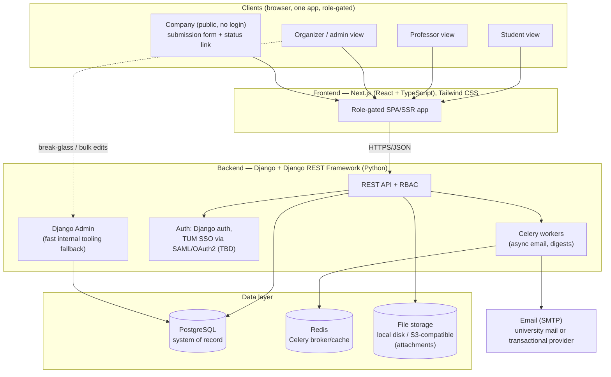

# Platform Architecture & Requirements Sketch

Based on [requirements.md](requirements.md). This is a first-pass sketch meant to anchor discussion, not a final spec.

## 1. Actors & roles

| Role | Who | Core needs |
|---|---|---|
| **Organizer** (admin) | The two staff currently running the Excel sheet | Full visibility/control over all projects, approve company submissions, manage guide content, manage professor/student accounts |
| **Professor** | School of Management (and possibly guest/external) faculty | Browse approved, unassigned topics; claim supervision; manage status of projects they supervise |
| **Student** | Enrolled students | Browse projects, read guides, track application/project status, optionally find teammates |
| **Company** | External, not a platform "user" in the traditional sense | Submit a project topic via form; get notified of status; likely no persistent login needed (email + token link is enough) |

A key existing constraint to encode, not just document: **eligibility rules** for who may supervise what (e.g. a professor not affiliated with the School of Management cannot supervise certain topics, even if the student knows them). This should be a rule the organizers configure, not something hardcoded — it was clearly a source of student confusion.

## 2. Core domain model (sketch)

```
Company        (name, contact info, verified?)
Project        (title, description, source: company|internal, status, company_id?,
                 assigned_professor_id?, created_at, status_history[])
User           (role: organizer|professor|student, department/school affiliation)
Application    (student_id, project_id, status)          -- student → project interest
Guide          (slug, title, body, category, audience, updated_by, updated_at)
StudentProfile (optional; interests, skills, looking_for_team: bool)  -- for req #3
Group          (optional; members[], formed_around: project_id?)      -- for req #3
AuditLogEntry  (actor_id, entity, action, timestamp)   -- since the whole point is
                                                          "what actually happens" visibility
```

Project status is a state machine, roughly:
`submitted → under_review → approved (unassigned) → assigned (professor chosen) → in_progress → completed / rejected`

Every transition should write an `AuditLogEntry` — requirement #1 is explicitly about organizers currently having *no visibility* into what happens after approval, so history/audit is not optional polish, it's the point of the system.

## 3. High-level architecture



One frontend app, role-gated views, rather than separate apps per role — the four user types share most of the same underlying data (projects), just with different permissions and default filters.

### Tech stack

| Layer | Choice | Why |
|---|---|---|
| Frontend | **Next.js (React + TypeScript)**, Tailwind CSS | Single codebase for all roles; SSR/SSG where useful for the public company-facing pages and guides; large ecosystem, easy to hand off/maintain |
| Backend | **Django + Django REST Framework (Python)** | Built-in auth, permissions/groups, and an admin panel that gives organizers a working internal tool almost for free on day one, well before the custom frontend is done — high leverage for a 2-person non-technical admin team |
| Database | **PostgreSQL** | Relational fits the project/status/audit model well; mature, free, easy to self-host or run managed |
| Async/notifications | **Celery + Redis** | Decouples email sending and any batch/digest jobs from the request cycle |
| Auth | Django auth to start; **SAML/OAuth2 to TUM SSO** if IT grants access (`django-allauth` / `djangosaml2`) | Avoids maintaining a parallel password store for students/professors if SSO is reachable |
| File storage | Local disk (small scale) or **S3-compatible object storage** | For company-submitted attachments and any project documents |
| Email | SMTP via university mail server or a transactional provider | Status-change notifications, company status-check links |
| Hosting | Docker Compose on a university-managed server, or a small cloud VM | Keeps data protection story simple if kept on university infrastructure |

This stack is a starting recommendation, not a hard requirement — the main constraint worth respecting is picking something a small team can maintain after handoff (both Next.js and Django are widely known, well-documented, and don't require exotic infra).

## 4. Backend requirements

**Auth & authorization**
- Role-based access control: organizer / professor / student, plus unauthenticated "company" flow (token-link based, no account).
- Ideally federate with TUM SSO if accessible; otherwise email/password with TUM email domain verification for students/professors. This is worth clarifying with IT early — it affects almost everything else.
- Configurable eligibility rules (e.g. school/department gating on who can supervise what).

**API surface (REST, roughly)**
- `Projects`: CRUD, status transitions, filtering/search (by status, department, company, keyword).
- `Applications`: student expresses interest / joins a project.
- `Companies` + submission endpoint: public-facing, rate-limited, with basic spam/abuse protection (captcha or similar) since it's unauthenticated.
- `Guides`: CMS-style content, versioned, organized by category/audience (e.g. "finding a supervisor for a company topic").
- `Users`/`Admin`: organizer-only management of professor/student accounts and eligibility rules.
- `AuditLog`: read endpoint for organizers — this is the direct fix for problem #1.
- (Optional, req #3) `StudentProfiles` / `Groups`: opt-in visibility, browse/match students looking for teammates.

**Non-functional**
- **Data protection / GDPR**: student and company data, hosted in the EU, minimal retention, organizer-only access to PII beyond what's needed. Worth a real conversation with TUM's data protection office before launch, not an afterthought.
- **Migration path**: import from the existing Excel sheet (one-time script/CSV import), so organizers aren't re-entering current in-flight projects by hand.
- **Notifications**: email on key transitions (company submitted → organizers; approved → professors; professor claims → student/company; status changes → relevant parties).
- **Audit trail**: every status change and edit logged with actor + timestamp (addresses req #1 directly).
- **Moodle relationship**: decide explicitly whether this platform *replaces* the Moodle page students currently see, or Moodle stays as a thin public-facing mirror fed from this system. That's a scope decision, not just a technical one — worth flagging to the two organizers.

## 5. Frontend requirements

**Shared**
- Single responsive web app; role determines nav/permissions, not a separate build.
- Search/filter/browse for projects (by status, topic area, company vs. internal).

**Organizer view**
- Dashboard of all projects with current status + history (the core "what's actually happening" view).
- Approve/reject queue for company submissions.
- Guide content editor (simple CMS — doesn't need to be fancy, markdown editor is probably enough).
- User/eligibility rule management.

**Professor view**
- List of approved, unassigned topics available to claim.
- "My projects" view with status management for what they supervise.

**Student view**
- Browse approved projects + apply/express interest.
- Guides section, organized by topic (e.g. "supervisor requirements for company projects", written from the concrete guidance the user already has and just needs implemented).
- Own application/project status tracking.
- (Optional, req #3) opt-in teammate finder: a profile flag "looking for a team" + browsable list, or attaching to a specific project's open slots.

**Company-facing (public, no auth)**
- Submission form mirroring the ladies' existing intake form fields.
- Status-check link (emailed token) rather than a full account.

## 6. Open questions worth resolving before building

1. **Auth**: TUM SSO available to this project, or self-managed accounts?
2. **Moodle**: replace, or keep as a synced/mirrored front for students?
3. **Scope of req #3** (teammate matching): fold into the existing Project/Application model, or a genuinely separate feature? Sketch above treats it as optional/additive so it doesn't block the core database (req #1) shipping first.
4. **Hosting**: university-managed infrastructure (data protection implications) vs. external cloud.
5. **Existing Excel schema**: get a copy to shape the real data model and migration script instead of guessing at fields.

## 7. Suggested build order

1. Core database + organizer admin view (req #1) — this alone fixes the visibility problem and is the highest-value piece.
2. Company submission + approval workflow (req #4) — plugs directly into #1's data model.
3. Student guides section (req #2) — largely content work once the platform shell exists.
4. Student teammate-matching (req #3) — optional, additive, lowest risk to defer.
